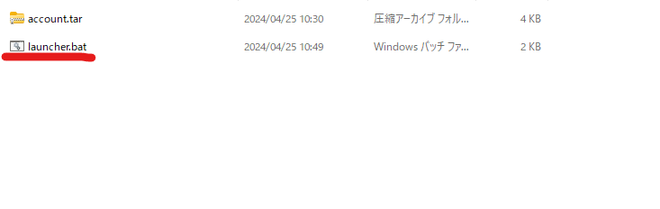
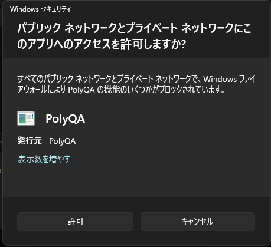
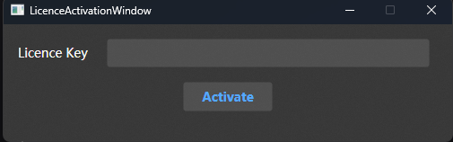

# Install

## PolyQA
- Licence契約後、送らせてもらった物の中から「**PolyQA.Launcher.zip**」を解凍してください。
  - 下記リンクが開ける方はこちらからダウンロードしてください。
  - https://drive.google.com/file/d/1ssUF36sDqiMHhf13LUz0NbUaEPpAh1yQ/view?usp=drive_link
- 中に入っている「launcher.bat」を起動して、PolyQAを起動してください。
  

:::warning
初回起動時にファイアウォールによるネットワークアクセスの許可ダイアログが表示される場合があります。
PolyQAを使用するためには、ゲームとの接続に使用するネットワークにおいて、ポート "8818" での受信接続を許可していただく必要があります。

:::

:::info
launcherから起動すると、常に新しいバージョンのPolyQAが起動されます。
:::

- LicenseActivationWindowが表示されるので、ライセンスキーを入力してアクティベートボタンを押してください。
  