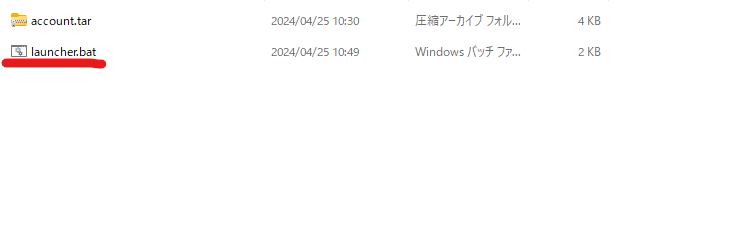

# PolyQA

## Install

### .NET
PolyQAは[.NET](https://dotnet.microsoft.com/)で開発されているため、RuntimeFrameworkをインストールしてある必要があります。
- 以下のリンクからインストーラーをダウンロードして、インストールしてください。
  - https://dotnet.microsoft.com/ja-jp/download/dotnet/thank-you/sdk-8.0.204-windows-x64-installer

### PolyQA
- Licence契約後、送らせてもらった物の中から「**PolyQA.Launcher.zip**」を解凍してください。
  - 下記リンクが開ける方はこちらからダウンロードしてください。
  - https://drive.google.com/file/d/1ssUF36sDqiMHhf13LUz0NbUaEPpAh1yQ/view?usp=drive_link
- 中に入っている「launcher.bat」を起動して、PolyQAを起動してください。
  
:::info
launcherから起動すると、常に新しいバージョンのPolyQAが起動されます。
:::
- LicenseActivationWindowが表示されるので、ライセンスキーを入力してアクティベートボタンを押してください。
  