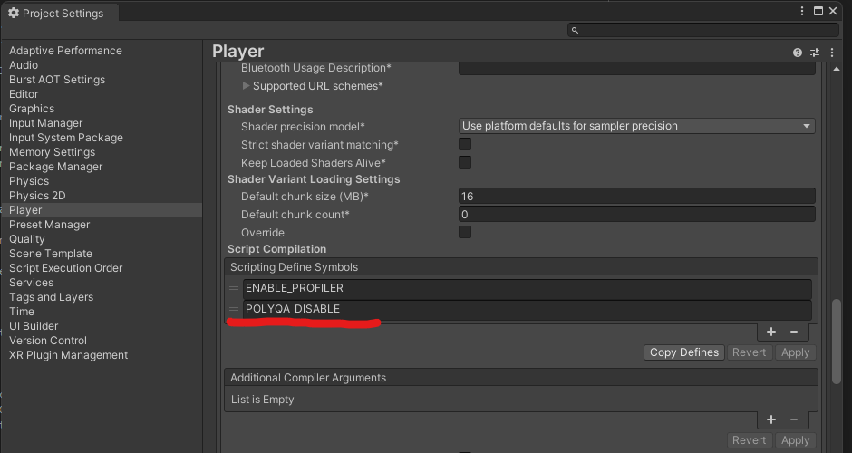

# 無効化方法

- 特定のキーワードをScripting Define Symbolsに定義すると、全てのDataSenderの動きは無効化されます。
- また、ConditionalAttributeの利用により、DataSender.Send()を行っている呼び出し自体も無効化されます。
    - [ConditionalAttributeに関するリファレンス](https://learn.microsoft.com/ja-jp/dotnet/csharp/language-reference/attributes/general)

## 方法
- メニューバーの「Edit」→「Project Settings...」から「Player」→「Script Compilation」→「Scripting Define Symbols」内に「**POLYQA_DISABLE**」を加えます
