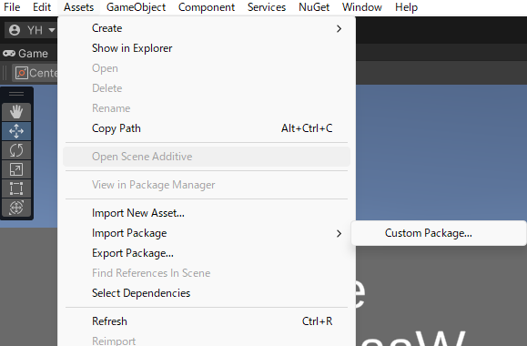
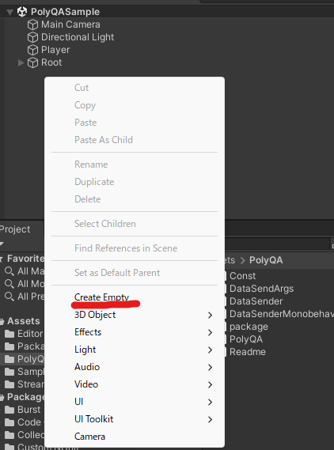
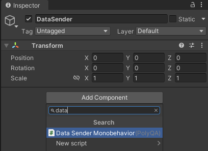
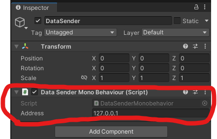
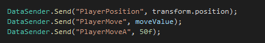

# Unity への組み込み

## unitypackageのImport
- Licence契約後、送らせてもらった物の中から「**PolyQA.unitypackage**」をUnityプロジェクトにインポートしてください。
    - [このリンク](https://drive.google.com/file/d/1zq_bRUsBa35GV-SCv8Mg1slHGTOMWmmz/view?usp=drive_link)が開ける方はこちらからダウンロードしてください。

### Import方法

Unity Editorのメニューバーから以下のように進んで選んでください

「Assets」-> 「Import Package」 -> 「Custom Package...」

## DataSenderMonoBehaviour の登録

- TitleScene等の、起動後一番最初に読み込まれるGameObjectがあるシーンで、空のゲームオブジェクトを作成してください。

- 作成されたゲームオブジェクトに「DataSender」と名前をつけてください。
- ゲームオブジェクトに、「DataSenderMonoBehaviour」コンポーネントをAddComponentしてください。

- この状態で[PolyQA.App](../app/1_install.md)を起動後、UnityEditorの再生を行ってみてください。[PolyQA.App](../app/1_install.md)の方にデータが送られていたら正しく設定されています。
    - ライセンス形式によってAppが提供されてない場合はこの工程はスキップしてください。

## DataSendの呼び出し
- C# Script上で「**DataSender.Send**」を呼び出してデータを送ります
    - 第一引数　key : string
        - データ自体の識別名になります。ユニークな名前をつけるようにしてください。
        - [良い例] PlayerPosition, HpSliderValue, CameraPosition
        - [悪い例] Position、Value
    - 第二引数　value : any type
        - 対応済みTypeは、「string int float bool Vector2 Vector3 Vector4 Quaternion Color byte sbyte short ushort uint long ulong double」
        - 実際に送られるデータになります。
    - 

    
## トラブルシューティング
- WIP