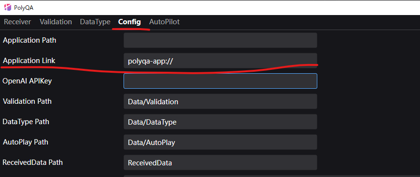
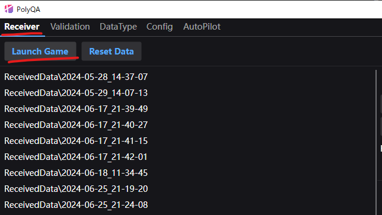

# Android

:::warning
PolyQAを使用するためには、ゲームとの接続に使用するネットワークにおいて、ポート `8818` での受信接続を許可していただく必要があります。
:::

:::danger
接続に問題がある場合、[トラブルシューティング](./troubleshooting) もご覧ください。
:::

PolyQAに接続するためにいくつかの起動方法を用意しています。
環境に合わせてご利用できる起動方法を使用してください。

## 事前準備

### adbのインストール（必要な方のみ）

案内している方法の中でadbコマンドを使用しているものがあります。
adbコマンドを使用するためにはツールのインストールが必要です。
[こちらのリンク](https://tech.la-fra.com/2018/07/29/post-204/) を参考にインストールしてください。

## 方法１：自動接続

ローカルネットワーク内からPolyQAを検索して接続しますので、まずはそのまま起動してください。

:::warning
ネットワーク設定により、ローカルネットワーク内での検索が制限されている場合がございます。
その場合、この機能は利用できませんので、他の起動方法を使用してください
:::

## 方法２：QRコードで起動する

PolyQAの「Config」画面でゲームの起動URL（Deep Link）を設定してください。



「Receiver」画面で「Launch Game」ボタンを押してください



QRコードが表示されますので、Androidのカメラで読み取ったURLからゲームを起動してください。

:::warning
Android標準のカメラアプリですと、読み取ったURLからゲームを起動できない場合があります。
その場合は、QRコードアプリをお試しください
:::

:::tip
インストール後、初回だけQRコードから起動する必要があります。前回の接続先は保存されるので、２回目以降は不要です。
一度アンインストールした場合は、再度QRコードから起動する必要があります。
:::

## 方法３：adbコマンドで起動する

- adbコマンドを使用して、*polyqa_address*というインテント引数にIPアドレスを設定して起動します。
- adbコマンドでUnityアプリを起動する方法は下記となります。

```
adb shell am start -n <パッケージ名>/<アクティビティ名> --es "polyqa_address" <PolyQA起動端末のIPアドレス>
```

:::info 例
`adb shell am start -n com.HogeCompany.HogeProduct/com.unity3d.player.UnityPlayerActivity --es "polyqa_address" 192.168.10.8`
:::

:::tip
インストール後、初回だけadbコマンドを使用して起動する必要があります。前回の接続先は保存されるので、２回目以降は不要です。
一度アンインストールした場合は、再度adbコマンドを使用して起動する必要があります。
:::

## 方法４：ポート転送を利用して接続する

Android端末とPCをUSB接続した状態で以下のコマンドを実行します。

```
adb reverse tcp:8818 tcp:8818
```

その後、Android端末側から操作してアプリを起動してください。

:::info
この方法はファイアウォールにによりPolyQAへの接続が制限されている場合に有効です。
Android端末のポートへの通信をPCのポートに転送することによって接続をしています。
:::