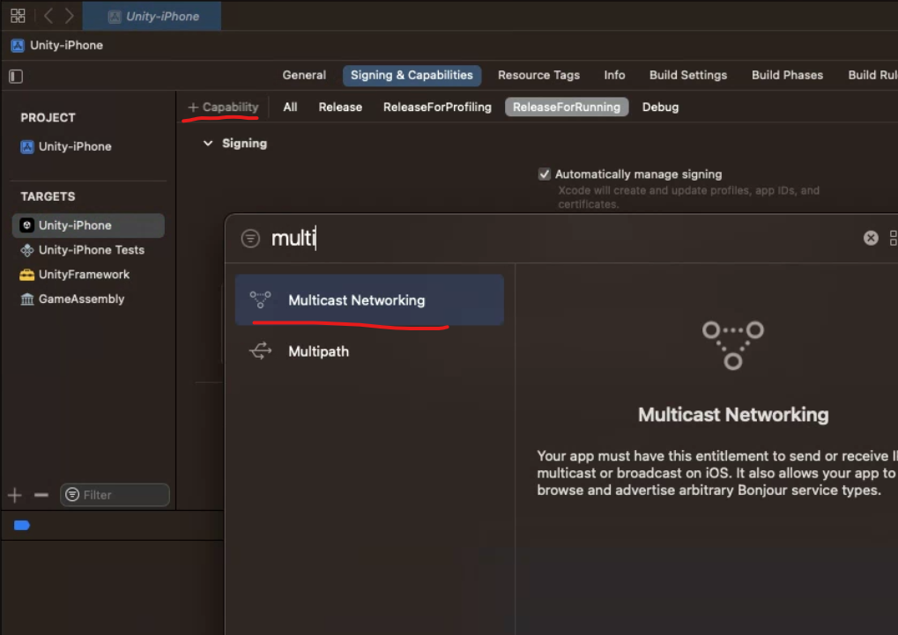

# iOS

:::warning
PolyQAを使用するためには、ゲームとの接続に使用するネットワークにおいて、ポート `8818` での受信接続を許可していただく必要があります。
:::

PolyQAに接続するためにいくつかの起動方法を用意しています。
環境に合わせてご利用できる起動方法を使用してください。

## 方法１：QRコードで起動する

PolyQAの「Config」画面でゲームの起動URL（Deep Link）を設定してください。

「Receiver」画面で「Launch Game」ボタンを押してください

QRコードが表示されますので、iOS端末のカメラで読み取ったURLからゲームを起動してください。

:::tip
インストール後、初回だけQRコードから起動する必要があります。前回の接続先は保存されるので、２回目以降は不要です。
一度アンインストールした場合は、再度QRコードから起動する必要があります。
:::

## 方法２：PolyQAを検索して接続

iOSアプリがローカルネットワーク内からPolyQAを検索して接続できるようにするには、いくつかの設定が必要になります。

### Multicast Networkingの申請

この機能は「Multicast Networking」を使用しているため、組織単位での申請が必要です。
[com\.apple\.developer\.networking\.multicast](https://developer.apple.com/documentation/bundleresources/entitlements/com_apple_developer_networking_multicast)
をご確認の上、
[Multicast Networking Entitlement Request](https://developer.apple.com/contact/request/networking-multicast)
からリクエストできます。

### iOSアプリの設定

リクエストが承認されたら、Xcodeでゲームアプリの設定を行います。
「+ Capability」から「Multicast Networking」を選択して追加してください。

上記の設定を行ったアプリは、起動時にローカルネットワーク内からPolyQAを検索して接続できます。

:::warning
ネットワーク設定により、ローカルネットワーク内での検索が制限されている場合がございます。
その場合、この機能は利用できませんので、他の起動方法を使用してください
:::

